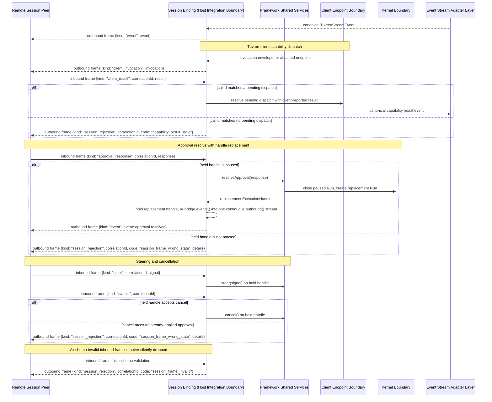

### 4.20 Duplex Session Inbound Routing and Rejection

- **Maps to PRD capability:** CAP-P0-019, CAP-P1-022, CAP-P0-061, CAP-P1-063

```mermaid
sequenceDiagram
  participant Peer as Remote Session Peer
  participant Binding as Session Binding (Host Integration Boundary)
  participant Framework as Framework Shared Services
  participant Client as Client Endpoint Boundary
  participant Kernel as Kernel Boundary
  participant Events as Event Stream Adapter Layer

  Events-->>Binding: canonical TuvrenStreamEvent
  Binding-->>Peer: outbound frame {kind: "event", event}

  Note over Binding,Client: Tuvren-client capability dispatch
  Client->>Binding: invocation envelope for attached endpoint
  Binding-->>Peer: outbound frame {kind: "client_invocation", invocation}
  Peer->>Binding: inbound frame {kind: "client_result", correlationId, result}
  alt callId matches a pending dispatch
    Binding->>Client: resolve pending dispatch with client-reported result
    Client-->>Events: canonical capability result event
  else callId matches no pending dispatch
    Binding-->>Peer: outbound frame {kind: "session_rejection", correlationId, code: "capability_result_stale"}
  end

  Note over Peer,Kernel: Approval resolve with handle replacement
  Peer->>Binding: inbound frame {kind: "approval_response", correlationId, response}
  alt held handle is paused
    Binding->>Framework: resolveApproval(response)
    Framework->>Kernel: close paused Run, create replacement Run
    Framework-->>Binding: replacement ExecutionHandle
    Binding->>Binding: hold replacement handle, re-bridge events() into one continuous outbound() stream
    Binding-->>Peer: outbound frame {kind: "event", event: approval.resolved}
  else held handle is not paused
    Binding-->>Peer: outbound frame {kind: "session_rejection", correlationId, code: "session_frame_wrong_state", details}
  end

  Note over Peer,Framework: Steering and cancellation
  Peer->>Binding: inbound frame {kind: "steer", correlationId, signal}
  Binding->>Framework: steer(signal) on held handle
  Peer->>Binding: inbound frame {kind: "cancel", correlationId}
  alt held handle accepts cancel
    Binding->>Framework: cancel() on held handle
  else cancel races an already-applied approval
    Binding-->>Peer: outbound frame {kind: "session_rejection", correlationId, code: "session_frame_wrong_state", details}
  end

  Note over Peer,Binding: A schema-invalid inbound frame is never silently dropped
  Peer->>Binding: inbound frame fails schema validation
  Binding-->>Peer: outbound frame {kind: "session_rejection", correlationId, code: "session_frame_invalid"}
```
