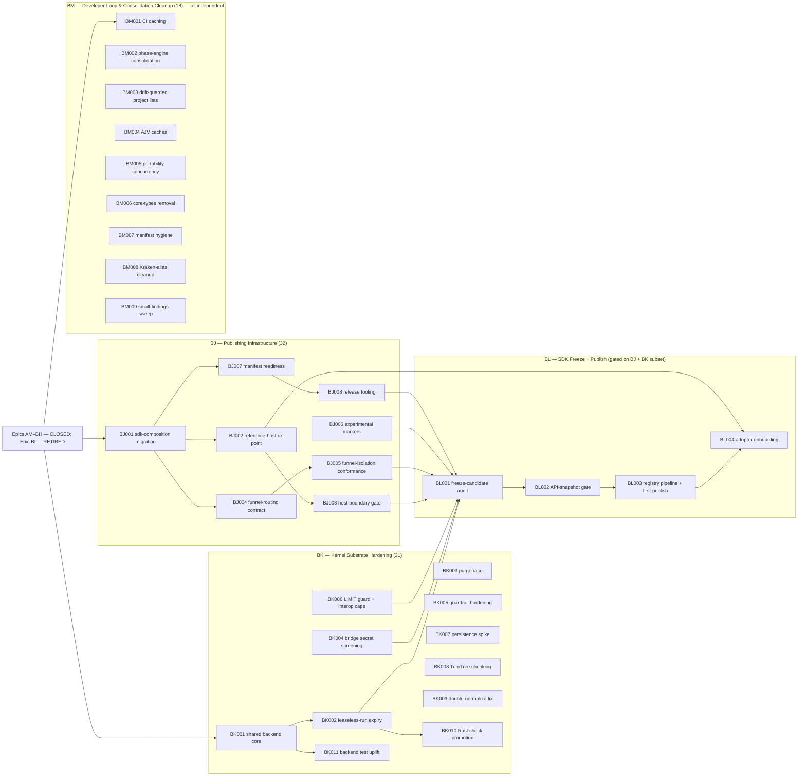

# Critical Path & Execution Plan

## 0. Version

**v0.39.0** — current local Stage 4 SemVer; full history in `changelog.md`.

## 1. Executive Summary & Active Critical Path

- **Total Active Story Points:** 97 (**97 remaining**) — the **Post-Audit SDK-Readiness block (Epics BJ–BM)**, opened by the 2026-07-04 constitutional audit (`.constitution/reports/audit-2026-07-04-170703-post-epic-87-baseline.md`) and the same-session pre-freeze interview, governed by PRD v0.12.0, Architecture v0.12.0, and TechSpec v0.32.0 (ADR-056/057/058). Per-epic: **BJ (Publishing Infrastructure) 32**, **BK (Kernel Substrate Hardening) 31**, **BL (SDK Freeze + Registry Publication) 16**, **BM (Developer-Loop & Consolidation Cleanup) 18**. The former **Epic BI (21 pts) is retired unexecuted and superseded** — the audit showed its starting assumption (packages nearly publishable) was false, and the interview added pre-freeze scope it never carried; its five tickets' intent is absorbed into BJ/BL (`.constitution/archived/EPIC-BI-sdk-stabilization-publication.md` records the exact mapping). Everything through Epic BH remains closed and retained in the Completed Work Ledger (`.constitution/tasks/completed/completed-work-ledger.md`).
- **Critical Path:** `KRT-BJ001 → KRT-BJ007 → KRT-BJ008 → KRT-BL001 → KRT-BL002 → KRT-BL003 → KRT-BL004` (31 pts of the 97). Epic BL's freeze-candidate audit (KRT-BL001) hard-depends on **all of BJ** (transitively, via KRT-BJ003/BJ005/BJ006/BJ008 — seven fan-in edges into BL001 in total) **plus the surface- and security-affecting BK subset** KRT-BK002/BK004/BK006, so the first published release ships those substrate correctness/security fixes baked in ("harden → then freeze", the interview's sequencing decision). The remaining BK hardening (BK003, BK005, BK007–BK011) is sequenced into the same block by that intent but changes no frozen public surface and is **not** a hard BL prerequisite. BJ and BK run in parallel; BM is fully parallel to both with no cross-epic dependencies in either direction.
- **Planning Note — SaaS-Readiness implementation epics landed; the freeze block is now open:** Epics BE, BF, BG, and BH have **landed**: BE's kernel `docs/KrakenKernelSpecification.md` §2.3 scope-resolved-identity claims and the framework scope notes, BF's §9.4 `maintenance.reclamation` reachability-primitive claims, BG's §5.2 backend-authoritative lease-clock + framework "Running Lease Ownership" side-effect-once / client-result-as-proposal claims, and BH's framework `docs/KrakenFrameworkSpecification.md` §1.1 v0.21 conversation-state-ownership claim, are all promoted from `missing-conformance-follow-up` to `authority-backed-conformance-covered` (the kernel-protocol authority packet declares `bindingSections.scope-isolation` and `bindingSections.reclamation` and registers the runnable, evidence-backed `kernel-scope-isolation.json` and `kernel-reclamation.json` plans; the shared-core operational-telemetry plan proves scope-correlated telemetry/transcripts, and BF's reclaim-probe + erasure-probe carry per-backend evidence across memory/SQLite/PostgreSQL; BG registers a `kernel.shared-lease-clock`-gated clock-skew-preemption check on `kernel-run-liveness.json` and a client-result-as-proposal check on `runtime-api-lifecycle-extended.json`; and BH registers the `provider-api-conversation-state.json` plan — gated behind the `providers.conversation-state-ownership` capability the providers conformance adapter advertises — in the provider-api authority packet, carrying per-lane evidence), with implementation source, schema, generated artifacts, conformance plans, and refreshed compatibility evidence all changed accordingly. The §9.4 non-support row (a backend advertising `maintenance.reclamation=false` rejecting with `kernel_capability_unsupported`) stays classified with the rest of the capability-gating contract (`missing-conformance-follow-up`, tracked to `KRT-AM010`), since the promoted plan only exercises capability-bearing backends.
- **Planning Note — the Post-Audit SDK-Readiness block adds authority surface before it freezes:** the former Epic BI assumed the block would only *freeze and publish* an already-stable surface and add no new semantics. The 2026-07-04 audit and pre-freeze interview refuted that: the block now hardens the kernel substrate and adds a construction-time funnel-routing contract **before** the freeze, so two of the four active epics carry authority-surface deltas that follow the same declare-then-promote discipline BE–BH used. **KRT-BK002** amends `spec/kernel/authority-packet.json` and `spec/conformance/kernel/plans/kernel-reclamation.json` with the leaseless-run expiry rule; **KRT-BK010** promotes the in-memory-expressible reclamation / scope-isolation / run-liveness checks into the Rust conformance lane (raising `rust-kernel` above today's 42/68). **KRT-BJ004** declares a new `TelemetryDestination` binding in `spec/core/authority-packet.json`, and **KRT-BJ005** registers the funnel-isolation checks on `spec/conformance/telemetry/plans/framework-operational-telemetry.json`. Each such ticket declares its surface in the owning boundary authority packet and only flips to `authority-backed-conformance-covered` once its plan is runnable, registered, and evidence-backed — the portability gate (`plan-applicability-has-adapter`) and the compatibility-evidence gate forbid registering a runnable plan before an adapter can execute it, exactly as they did for `KRT-BE001`/`KRT-BF001`/`KRT-BG001`/`KRT-BH001` and their promotion tickets. Only after Epics BJ and BK land does the freeze epic (BL) audit, snapshot, and publish the amended surface, so `bun run verify` and the docs-to-authority freeze gate stay **green** with no false conformance coverage throughout.
- **Planning Assumptions:** The Tooling block (Epics AW–BC) is governed by PRD v0.9.0, Architecture v0.9.0, and TechSpec v0.29.0 (ADR-046, ADR-047); the upstream contracts (`@tuvren/core/capabilities` §3.13, the §4.21 contract) are authored, so the tickets are implementation-ready. Tuvren-client scope is the runtime protocol + attachment seam only — concrete client endpoints (browser extension, desktop, device) remain host-developer deliverables per PRD §6. Provider-native and provider-mediated scope is runtime support proven against today's AI-SDK-bridged providers, with at least one concrete proof per class and additional providers additive later. Epic BD (formerly Epic AW) is governed by PRD v0.8.0 / Architecture v0.8.0 / TechSpec v0.28.x (ADR-042 through ADR-045); it is now closed, having run after the Tooling block per product priority. The prior chain (PRD v0.7.0 / Architecture v0.7.0 / TechSpec v0.27.x, ADR-034 through ADR-041, Epics AM-AT) is closed. The Tooling block reframes tool representation within the existing TypeScript line and keeps today's developer-defined tool path working unchanged as the Tuvren-server execution class; it adds no Rust framework/product scope, no new host protocol, no new backend, and no new model-provider family beyond the existing AI SDK bridge. The `product proof gate`, `platform gate`, and `portability gate` from Epic AL remain the staged-gate baseline. The locked external dependency versions per TechSpec §1 still apply.

### Brownfield Continuity Note

- Epics A-AL remain historical context. Epic AL's closure of the staged gates is the foundation this chain extends.
- The current repo proves the host-facing SDK through the serious REPL host (`@tuvren/repl-host`) and its named `proving-host:*` validation lanes; exercises PostgreSQL as a first-class backend; closes the portability gate through `tools/scripts/portability-gate.ts`; and carries the shared primitive surface in `@tuvren/core` with source-bearing runtime implementation in `@tuvren/runtime`. The old contract package handles and `@tuvren/runtime-core` are compatibility shims only.
- Historical closure inventories live under `.constitution/archived/` for audit only.

### Sequential Scope Rule

- The Tooling block (Epics AW–BC) restructures how tools are represented within the existing TypeScript line. It adds no Rust scope, no new model-provider family beyond the existing AI SDK bridge, no new host protocol, and no new backend. It keeps the existing `defineTool` / Tool Execution Gateway path working unchanged as the Tuvren-server execution class.
- The Tuvren-client execution class (Epic AZ) is **closed**: the runtime gained the leased client-endpoint dispatch/result protocol and attachment seam, client-side MCP classification, availability/staleness handling, and partial-observability model. Concrete client endpoints (browser extension, desktop app, device agent) remain host-developer deliverables per PRD §6.
- Provider-native and provider-mediated execution (Epic AY) is closed: the runtime gained representation, configuration, attribution, and observation for those classes with one concrete proof each through mock-backed end-to-end tests. Real live-provider testing (API keys not in CI) is additive scope per the gap note in `.constitution/reports/ay001-provider-surface-matrix.md`. The AY005 multi-turn providerContinuity round-trip is structurally wired; a complete multi-turn proof is deferred to a follow-on epic.
- No Rust framework or Rust product-line expansion is active. No first-class Tuvren model-provider packages are active beyond the AI SDK bridge; the MCP client remains a tool source / binding mechanism, not a model provider.
- No additional host protocols beyond the canonical stream and SSE surfaces are active. Public package publication is **active** scope in the Post-Audit SDK-Readiness block: the publishing infrastructure (Epic BJ) and the substrate hardening (Epic BK) run first, then the freeze-and-publish epic (Epic BL) audits, snapshots, and publishes the curated surface. This block supersedes the former single Epic BI, which assumed the packages were already near-publishable; the audit showed they were not (no experimental markers, no snapshot gate, no release pipeline), so the freeze is now gated behind real hardening rather than run directly.
- The production-trust block (now Epic BD) hardened the existing TypeScript line only and ran after the Tooling block; it is now closed. Epic AU's fault-injection seam is closed and testkit-only; Epic AV's telemetry surface is closed; execution bounds and secret isolation (Epic BD) added framework-owned guards and credential-edge confinement without altering kernel semantics.

### Planning Heuristic

- Prefer ticket slices that fit focused solo-dev execution while preserving strict gates around product proof, backend rigor, and conformance truthfulness.
- Treat “green because a private harness succeeds” as insufficient evidence once a proving-host or conformance ticket exists on the critical path.
- Size each epic to roughly **3k–8k LoC** of implementation. In the closed SaaS-Readiness block, BE and BF sat toward the upper end (multi-backend scope work; the kernel reclamation primitive plus the multi-edge crypto-shredding envelope), while BG and BH sat toward the lower end (lease-clock refinement, conversation-state hardening). In the active Post-Audit SDK-Readiness block, BJ and BK sit toward the upper end (the sdk-composition migration plus release tooling; the shared backend-core extraction plus the substrate correctness/security fixes), while BL and BM sit toward the lower end (freeze/snapshot/publish tooling; independently-mergeable developer-loop cleanups). Story-point totals (BJ 32, BK 31, BL 16, BM 18) are the primary sizing signal for this block; the LoC band is secondary because several tickets are tooling/manifest/authority edits rather than feature code.

## 2. Project Phasing & Iteration Strategy

### Current Active Scope

- **Block 7 — Post-Audit SDK-Readiness (Epics BJ–BM): ACTIVE.** Opened by the 2026-07-04 constitutional audit (`.constitution/reports/audit-2026-07-04-170703-post-epic-87-baseline.md`) and the same-session pre-freeze interview, governed by PRD v0.12.0 (CAP-P0-070/071/072, CAP-P1-073), Architecture v0.12.0, and TechSpec v0.32.0 (ADR-056/057/058). This block replaces the former single Epic BI: instead of freezing an assumed-stable surface, it hardens the substrate and reshapes the host-facing tier first, then freezes and publishes. Tuvren stays tenancy-agnostic and funnel-agnostic at the kernel — the two-funnel content/telemetry separation and construction-time routing live at the sdk/runtime composition tier, and the kernel remains scope-free and funnel-unaware. **97 active story points; BJ and BK run in parallel, BM is fully parallel to both, and BL's freeze gate hard-depends on all of BJ plus the surface/security BK subset (BK002/BK004/BK006), with the rest of BK sequenced into the same block by intent ("harden → then freeze").**
  - **BJ — Publishing Infrastructure: ACTIVE (32 pts).** The ADR-057 sdk-composition migration (`createTuvren` and curated re-exports move to `@tuvren/sdk`, `@tuvren/runtime` demoted to an internal engine, the inverted peer-dep corrected, ADR-040 string-kind shorthands retired); the Reference Host re-pointed off `@tuvren/runtime` onto the host import contract, with an automated host-boundary gate; the ADR-058 `TelemetryDestination` funnel-routing contract on `@tuvren/core/telemetry` with construction-time routing and one-directional failure isolation, plus funnel-isolation conformance; ADR-056 `@experimental` markers on the `@tuvren/core/capabilities` surface; publishable-package manifest readiness (`files`/`license`/`description`/`repository`, private-flag decisions); and changeset-class release-versioning scaffolding honoring the ADR-037 single-core-version peer-dep model. No actual registry publish (that is BL).
  - **BK — Kernel Substrate Hardening: ACTIVE (31 pts).** Extract the shared kernel-backend invariant core (memory/postgres/sqlite stop hand-copying reclamation/transition/immutability logic); fix the leaseless-run reclamation-horizon pin (a crashed leaseless run currently blocks reclamation forever) with an authority-packet + conformance-plan amendment; fix the `purgeScope` serialization-bypass race; screen provider-bridge `bridgeExtras` secrets at the seam (ADR-044); harden the guardrail gate's `shell: true` manifest-command execution; guard the sqlite `LIMIT` interpolation and add gRPC interop resource caps; a persistence-model benchmark **Spike** (`SPK-BK007`); caller-side chunk-aware TurnTree writes (ADR-011); the sqlite rollback double-normalize fix; promote the in-memory-expressible kernel checks into the Rust lane (past today's 42/68); and backend-specific storage test uplift. Sequenced to close before the BL freeze so substrate decisions settle while the surface is still open.
  - **BL — SDK Freeze + Registry Publication: ACTIVE (16 pts, gated on all of BJ + the surface/security BK subset).** Freeze-candidate audit of the ADR-057-amended stable-core surface; the ADR-056 API-surface snapshot / freeze gate wired into `check`/`verify`; the registry publication pipeline with provenance and the first real publish (leaf packages peer-depending on a single `@tuvren/core` version per ADR-037); and adopter onboarding covering the stable/experimental boundary, the host import contract, and the three funnel-routing topologies.
  - **BM — Developer-Loop & Consolidation Cleanup: ACTIVE (18 pts, fully parallel).** CI caching + shared composite setup; verification phase-engine consolidation; drift-guarded kernel project lists; conformance-tooling Ajv validator caches; portability-check bounded concurrency; `@tuvren/core-types` shim removal; workspace manifest hygiene; `Kraken*`-alias cleanup with a public-surface lint guard; and a small-findings sweep (`detachPromise` contract doc, README prereqs, perf-benchmarks stale name, `services:up` readiness wait). Every ticket declares `Dependencies: None` and touches no kernel-authority or interop-protocol surface owned by BJ/BK.
- **Block 6 — SaaS-Readiness (Epics BE–BH landed; Epic BI retired/superseded): FULLY CLOSED.** The runtime is functionally complete and production-trust-hardened; this block made it safe and stable to embed as a multi-tenant SaaS substrate without forking, governed by PRD v0.10.0 (CAP-P0-064 through CAP-P0-070), Architecture v0.10.0, and TechSpec v0.30.x (ADR-048 through ADR-055). Tuvren stays tenancy-agnostic: it provides the mechanism (scope seam, isolation, reclamation, erasure, side-effect-once, conversation-state ownership, a published stable SDK), and the host owns tenancy/retention policy and keys. The keystone Epic BE, the data-lifecycle Epic BF, the lease-clock Epic BG, and the conversation-state Epic BH have all landed; the block's final SDK-freeze epic, formerly BI, was **retired unexecuted** and its intent absorbed into the Post-Audit SDK-Readiness block above (Block 7) after the audit refuted BI's near-publishable premise.
  - **BE — Tenancy Scope Seam + Isolation-by-Construction: CLOSED.** Scope bound at backend construction across memory/SQLite/PostgreSQL (memory scope-keyed stores; SQLite file-per-scope; PostgreSQL scope-keyed `(snapshot_id, scope)` row under row-level isolation); scope-resolved content addressing with no cross-scope dedup; durable-read scope safety across all three backends; scope-tagged telemetry and transcripts proven leak-free; cross-scope isolation conformance promoted to runnable, evidence-backed coverage. The keystone; the kernel syscall surface and gRPC interop stay scope-free (ADR-048). See Completed Work Ledger.
  - **BF — Data Lifecycle: Reclamation + Crypto-Shredding Erasure: CLOSED.** Kernel `maintenance.reclamation` reachability mark-and-sweep (capability-advertised, grace-windowed against the oldest active lease, per-Scope) across memory/SQLite/PostgreSQL, with non-supporting backends rejecting via `kernel_capability_unsupported`; host-key-encrypted untrusted-edge payload envelope (interface-first `PayloadCodec` contract plus a default AES-256-GCM codec; keys stay host-held, the kernel stores only ciphertext + keyRef) at the provider/tool/MCP/client edges with typed erased reads; per-scope reclaim and the §4.17 tenant-offboarding flow (destroy keys + reclaim + drop the scope partition, no other scope affected); data-lifecycle conformance promoted to runnable, evidence-backed coverage (reclaim-probe + erasure-probe, all five checks passing across the three backends). See Completed Work Ledger.
  - **BG — Backend-Authoritative Lease Clock + Side-Effect-Once: CLOSED.** PostgreSQL backend-time lease stamping/comparison via `RuntimeBackendTx.now()` (`clock_timestamp()`) and the `shared-lease-clock` `BackendCapability` bit (memory + single-file SQLite keep the in-process clock); the `(runId, callId, fencingToken)` idempotency envelope on server (`ToolExecutionContext`) and client (`ClientInvocationEnvelope`) dispatch; no-retry of in-flight `nonRetryable` on lease loss with completed results recovered by `callId`; client-result-as-proposal gated behind a valid run fencing token; preemption-under-clock-skew conformance promoted to runnable, evidence-backed coverage (a `kernel.shared-lease-clock`-gated clock-skew-preemption check proving no split-brain + side-effect-once-by-`callId`, and a client-result-as-proposal check proving no stale-client commit). Realizes ADR-050/052; the `(runId, callId, fencingToken)` identity is a per-attempt envelope and cross-recovery side-effect-once is achieved by composition (recorded in tech-spec/changelog v0.30.3). See Completed Work Ledger.
  - **BH — Conversation-State Ownership Hardening: CLOSED.** Reconstruct-from-DAG proof (next-turn provider request rebuilt purely from durable head-state equals the live-path request, no provider-held state); continuity artifacts shreddable via the BF005 `MESSAGE_PAYLOAD_EDGE` codec, so no new `provider.continuity` edge was needed; the AY005 multi-turn `providerContinuity` round-trip closed with a real multi-turn test (existing message-part replay already round-trips); provider-side caching proven correctness-neutral (identical produced canonical result on cache miss vs hit, only cost/latency differ); and the ADR-055 AI SDK bridge `providerExecuted`/`dynamic` fidelity audit, which confirmed structural immunity to vercel/ai #10888 and found + fixed a real defect (declared provider-executed `tool-call` parts were rejected before the `tool-result` carrying the provider-native attribution; the fix skips declared provider-executed calls and still rejects undeclared ones). The framework §1.1 v0.21 conversation-state note is promoted to `authority-backed-conformance-covered`. See Completed Work Ledger.
  - **BI — SDK Stabilization + npm Publication: RETIRED / SUPERSEDED (never started).** BI's five tickets are absorbed into Block 7: the API-stability audit/freeze (BI001) → KRT-BL001; experimental `@tuvren/core/capabilities` marking (BI002) → KRT-BJ006; the API-stability gate (BI003) → KRT-BL002; the registry-publication pipeline (BI004) → KRT-BJ007/BJ008 (manifest + release tooling) and KRT-BL003 (first publish); adopter onboarding (BI005) → KRT-BL004 (BI's ADR-057 sdk-composition and ADR-058 funnel-routing prerequisites had no BI ticket and are new work under BJ). No KRT-BI ticket was executed. The epic file is archived at `.constitution/archived/EPIC-BI-sdk-stabilization-publication.md` with the same absorption map recorded verbatim in its supersession note.
- **Block 5 — Tooling restructuring (Epics AW–BC): FULLY CLOSED.** AW delivered the capability-orchestration foundation; AX delivered the full Tuvren-server execution class; AY delivered provider-native and provider-mediated execution classes; AZ delivered the Tuvren-client execution class; BA delivered the cross-class invocation lifecycle and observation model; BB delivered the full exposure/invocation policy model; BC delivered the cross-class integration conformance, normative §11 framework-spec section, portability inventory v0.4.0, and a clean `bun run verify` with 446/446 applicable framework checks passing. See Completed Work Ledger.
  - **AW — Capability Orchestration Foundation: CLOSED.** See Completed Work Ledger.
  - **AX — Tuvren-Server Execution Class: CLOSED.** See Completed Work Ledger.
  - **AY — Provider-Native & Provider-Mediated Execution Classes: CLOSED.** See Completed Work Ledger.
  - **AZ — Tuvren-Client Execution Class: CLOSED.** See Completed Work Ledger.
  - **BA — Invocation Lifecycle & Observation Model: CLOSED.** See Completed Work Ledger.
  - **BB — Exposure & Invocation Policy Model: CLOSED.** See Completed Work Ledger.
  - **BC — Tooling Restructuring Closeout: CLOSED.** See Completed Work Ledger.
- **Block 4 — Production trust remainder (Epic BD, formerly Epic AW): CLOSED.** Hardened execution bounds with a typed `execution_bound_exceeded` terminal result and a framework-owned bounds guard enforced above runner discretion (iteration/tool-call/wall-clock hard stops, concurrency throttle, deadline-abort propagation, late-completion ignoring); secret isolation across durable, canonical-stream, telemetry, and transcript surfaces verified by a shared runner-owned secret-absence helper; and independent verification that approval gates are non-bypassable and untrusted MCP/tool inputs are validated before execution. `KRT-BD001` (telemetry secret-screening helpers) closed earlier with Epic AV. With Epic BD closed, the active execution plan is empty. See Completed Work Ledger.
- **Block 1 — Boundary correctness gate (Epics AM, AN, AO):** closed. `thread.list`, base-handle `awaitResult`, and the five-method `TuvrenRuntime` durable-read surface.
- **Block 2 — Curated surface + ergonomics (Epics AP, AQ, AR):** closed. `@tuvren/core` consolidation, schema-agnostic `defineTool`, and the `createTuvren({...})` batteries-included factory.
- **Block 3 — Capability spikes (Epics AS, AT):** closed. `@tuvren/mcp-client` as a first-class tool source and the consolidated REPL reference host with headless mode and transcript replay.

### Future / Deferred Scope

- Rust framework and Rust product-line work — still blocked.
- Native first-class Tuvren-owned model-provider clients (Anthropic/OpenAI/Gemini) beyond the TypeScript AI SDK bridge — deferred behind the named ADR-055 trigger (provider statefulness that cannot round-trip through the baseline `LanguageModelV3` contract, or context-manifest-driven optimizations the bridge cannot express). Recast as Epic BP below.
- Cross-tenant thread search, multi-tenant ACLs, full-text indexed querying through the embeddable SDK (deferred to a future hosted/server projection).
- Server or REST projection of the durable-read surface (same future projection).
- Model Context Protocol server-side projection — Tuvren as an MCP server. Only the client side and the MCP-as-binding classification are in scope.
- Concrete client endpoint products (browser extension, desktop app, device agent) — the runtime orchestrates and leases attached client endpoints (Epic AZ) but does not ship the endpoints themselves.
- Schema adapters beyond Zod, Standard Schema, and wrapped JSON Schema in the core surface.
- Runner hot-swap or additional runners beyond the ReAct baseline.
- Additional host protocols beyond the canonical stream and SSE surfaces; additional official backends beyond memory, SQLite, and PostgreSQL.
- **Explicitly deferred audit findings (not carried into the active BJ–BM block).** Two vetted findings from the 2026-07-04 audit are consciously off-theme for SDK-readiness and parked here rather than ticketed, so every vetted finding is accounted for:
  - **Interop-seam trace correlation (audit [G-02], MED/HIGH).** No correlation/trace ID crosses the kernel gRPC interop seam — the only cross-process, cross-language boundary. The fix (an optional W3C `trace_context`/`traceparent` field on the interop request envelope, threaded into both sides' telemetry attributes) is a proto/authority change to the kernel interop contract, a distinct observability theme from the SDK-composition/freeze work; it lands most naturally alongside the deferred Rust-kernel/interop work (Epic BN) or as its own future authority-change pass, not inside the freeze block.
  - **MCP-client endpoint/command caller-obligation (audit row 34, LOW\*/latent).** The MCP HTTP-SSE endpoint accepts any URL and the stdio command is unguarded (`typescript/tools/mcp-client/src/lib/mcp-sdk-client.ts:117-132`) — a latent SSRF/command surface only if a host ever makes MCP config dynamic/untrusted, which the current trusted-config model does not. Deferred as a documentation caller-obligation note (per ADR-039) rather than a code change, since there is no present-state defect.
#### Post-SDK-Readiness Roadmap (Epics BN–BS) — Named, Not Yet Ticketed

The letters BJ–BM were **reclaimed** by the active Post-Audit SDK-Readiness block above (Publishing Infrastructure, Kernel Substrate Hardening, SDK Freeze + Registry Publication, Developer-Loop & Consolidation Cleanup). The previously-sketched roadmap epics that had squatted on BJ–BM are therefore **renumbered to BP–BS**, and the two new deferred themes surfaced by the 2026-07-04 audit take the next free letters BN–BO. All six stay named-but-not-yet-ticketed, recorded with enough scope to anchor a future planning session:

- **Epic BN — Rust Kernel Persistence + Conformance Parity.** Give the Rust kernel a durable backend (today it is in-memory only) and close the remaining conformance gap: the restart/crash-recovery families (`kernel-restart-af.*`, `kernel-restart-recovery.close_reopen_checkpoint`) that KRT-BK010 explicitly could not promote because an in-memory kernel cannot express process restart. Referenced as the deferral target by KRT-BK010. The semantics are already certified against the TypeScript reference; this epic is persistence + the restart-dependent checks, not new protocol.
- **Epic BO — Official Durable Telemetry Destination Adapters (CAP-P1-073).** Concrete `TelemetryDestination` adapters (e.g. an OTel-collector or durable-store destination) built behind the ADR-058 stable contract that Epic BJ (KRT-BJ004) freezes. Deferred per ADR-058 §6 and CAP-P1-073: the contract ships first so hosts can route telemetry immediately with their own destinations; first-party adapters follow additively without a surface change. Referenced as the deferral target by KRT-BJ004.
- **Epic BP — Native Provider Clients.** First-class Anthropic/OpenAI/Gemini clients implementing the existing Tuvren provider contract, additive to (never replacing) the AI SDK bridge. Deferred behind the named ADR-055 trigger; the standing business case is the full-input-token cost of conversation-state ownership (ADR-053) that manifest-driven caching in a native client would cut. (Formerly sketched as Epic BJ.)
- **Epic BQ — Performance Characterization & Regression Budgets.** Benchmark the hot paths (including the scope, reclamation, and lease-clock additions), publish documented performance budgets, and wire a `bench` regression gate into the canonical verification path. Consumes the KRT-BK007 persistence-model spike's measured baseline as a starting input. (Formerly sketched as Epic BK.)
- **Epic BR — Documentation & Onboarding.** Docs site, getting-started, cookbook, and API reference for the now-published stable core, extending the adopter-onboarding seed in KRT-BL004. (Formerly sketched as Epic BL.)
- **Epic BS — Reference Application (Dogfood Target).** A real, non-trivial multi-tenant application built end-to-end on the published SaaS-ready SDK that exercises the capability-orchestration model and the two-funnel routing seam, surfacing API friction against the frozen surface. (Formerly sketched as Epic BM.)

### Archived or Already Completed Scope

- Epic AH completed the constitutional authority reset; the live authority chain is the four constitutional documents plus explicit support inputs.
- Epics A-Q established the baseline TypeScript runtime, ReAct path, provider bridge, stream adapters, playground host, and release-hardening work.
- Epics AI–AL completed the high-level SDK audit, the serious REPL proving host, the PostgreSQL platform gate, and the portability-gate closure.
- Epics R-AG established the multi-language transition foundation, shared conformance architecture, and kernel interop.
- Epics AM-AV are summarized in the Completed Work Ledger (`.constitution/tasks/completed/completed-work-ledger.md`).
- The Tooling block (Epics AW–BC), the trust block (Epic BD, Trust-Boundary Security Hardening), the tenancy keystone (Epic BE, Tenancy Scope Seam + Isolation-by-Construction), the data-lifecycle epic (Epic BF, Reclamation + Crypto-Shredding Erasure), the lease-clock epic (Epic BG, Backend-Authoritative Lease Clock + Side-Effect-Once), and the conversation-state epic (Epic BH, Conversation-State Ownership Hardening) are fully closed. Epic BI (SDK Stabilization + Publication) was retired unexecuted and superseded; its epic file lives at `.constitution/archived/EPIC-BI-sdk-stabilization-publication.md` for audit only. The active execution plan is now the Post-Audit SDK-Readiness block (Epics BJ–BM); see Current Active Scope. Its own deferred follow-ons are the Post-SDK-Readiness Roadmap (Epics BN–BS).

## 3. Build Order (Mermaid)

Active Post-Audit SDK-Readiness block only (Epics AM–BH are closed; Epic BI is retired; Epics BN–BS are deferred and excluded). Arrows express "depends on" (tail depends on head's completion). BJ and BK run in parallel; BM is fully independent; BL's freeze-candidate audit (BL001) fans in from **seven** BJ/BK tickets — four from BJ (BJ003/BJ005/BJ006/BJ008) and three from BK (BK002/BK004/BK006). Every ticket with `Dependencies: None` — BJ006, BK003–BK009, and all nine of BM — is an independent root schedulable at block open. The `priorClosed` arrows mark each epic's representative entry point (BJ001, BK001, BM001), not the only available starts, so the remaining no-dependency nodes drawn without an incoming arrow (BJ006, BK003–BK009, BM002–BM009) are independent roots, not orphans.

## 5. Issue-Level Definition of Done

The active chain is not closed until every applicable statement below is true in the repository and in the live constitution.

### SaaS-Readiness block (Epics BE–BH) — "Tuvren is embeddable as a multi-tenant SaaS substrate"

- **(Epic BE — CLOSED; satisfied.)** A host binds a Scope at backend/connection construction and gets isolation-by-construction: across memory, SQLite, and PostgreSQL, no read, enumeration, or existence check crosses a Scope, identical content in two Scopes is two independent durable objects, and the kernel syscall surface and gRPC interop remain scope-free (no scope argument). Cross-scope isolation conformance passes per backend; telemetry and transcripts are scope-correlated and carry no other Scope's data.
- **(Epic BF — CLOSED; satisfied.)** The kernel exposes a capability-gated `maintenance.reclamation` reachability primitive that releases only state unreachable from live roots, is grace-windowed against active leases, and is per-Scope; backends advertise support honestly and non-supporting backends reject with `kernel_capability_unsupported`. Sensitive untrusted-edge payloads (provider/tool/MCP/client results and carried continuity artifacts) are stored as host-key-encrypted references so erasure is crypto-shredding (host destroys the key) that renders the payload unrecoverable while the lineage hash structure stays intact; the tenant-offboarding flow (drop Scope + destroy keys) works. Data-lifecycle conformance proves no reachable state is released and erasure preserves lineage structure.
- **(Epic BG — CLOSED; satisfied.)** For shared multi-worker backends the lease-expiry clock is backend-authoritative (PostgreSQL server time via `RuntimeBackendTx.now()`), the `BackendCapability` advertises shared-lease-clock support, single-writer embedded backends keep the in-process clock, and recovery of a stale execution never re-runs an in-flight `nonRetryable` side effect: side-effecting invocations carry the `(runId, callId, fencingToken)` idempotency identity, and a stale or late client-reported result is a proposal that cannot mutate committed history. Preemption-under-clock-skew conformance proves at-most-once side effects and no stale-client commit. (Realization note: the identity is a per-attempt envelope key; cross-recovery side-effect-once is achieved by composition of backend-clock no-split-brain + no-retry + recovery-skip-by-`callId` + client-result-as-proposal — tech-spec/changelog v0.30.3.)
- **(Epic BH — CLOSED; satisfied.)** The durable lineage is the unconditional source of truth for provider requests: a request is reconstructable from lineage alone (proven by rebuilding the next-turn provider request from durable head-state with no provider-held state, equal to the live-path request), carried continuity artifacts are shreddable references (message-part `providerMetadata` via the BF005 `MESSAGE_PAYLOAD_EDGE` codec — no separate `provider.continuity` edge was needed), provider-side caching is proven correctness-neutral (identical produced canonical result on cache miss vs hit, only cost/latency differ), the AY005 multi-turn `providerContinuity` round-trip is closed with a real multi-turn test, and the AI SDK bridge `providerExecuted`/`dynamic` fidelity audit confirms provider-native attribution without spurious validation errors (structurally immune to vercel/ai #10888; one inline provider-executed-call rejection defect found and fixed).
- The SDK-freeze-and-publish DoD formerly stated here for Epic BI (curated surface frozen under semantic versioning with an API-stability gate; `@tuvren/core/capabilities` marked experimental and excluded; no `Kraken*` leak; registry publication with peer-dependency version-skew safety and provenance; an adopter can install and issue a first Turn) is **superseded**: it now lives, expanded for the ADR-057 sdk-composition boundary and the ADR-058 funnel-routing contract, in the Post-Audit SDK-Readiness block DoD below.
- Each implementation epic's first ticket (`KRT-BE001`, `KRT-BF001`, `KRT-BG001`, `KRT-BH001`) promotes the docs-to-authority coverage matrix, authority packets, and conformance plans for the kernel v0.12 / framework v0.21 spec sections it implements from `missing-conformance-follow-up` to `authority-backed-conformance-covered`, so `bun run verify` exits zero from a clean checkout. Epics BE, BF, BG, and BH have all completed this cascade (BE's §2.3 scope-isolation, BF's §9.4 reclamation, BG's §5.2 backend-clock + framework side-effect-once / client-result-as-proposal, and BH's §1.1 conversation-state-ownership claims are authority-backed and evidence-covered; the §9.4 non-support rejection row stays with the capability-gating contract tracked to `KRT-AM010`). No SaaS-Readiness spec section remains deferred; the successor Post-Audit SDK-Readiness block adds its own authority surface (the leaseless-expiry rule, the `TelemetryDestination` binding, the funnel-isolation checks, and the Rust check promotion) under the same declare-then-promote discipline before it freezes — see that block's DoD below.

### Post-Audit SDK-Readiness block (Epics BJ–BM) — "Tuvren is a published, frozen, funnel-aware framework whose hosts touch only the curated surface"

The active chain is not closed until every applicable statement below is true in the repository and in the live constitution.

- **(Epic BJ — host-facing tier reshaped and publishable.)** `@tuvren/sdk` is the composition tier: `createTuvren` and the curated `@tuvren/core` re-exports export from `@tuvren/sdk`'s root, `@tuvren/runtime` carries no host-facing re-exports and is marked an internal engine package, the previously-inverted peer-dependency edge is corrected (sdk depends on runtime, not the reverse), and `CreateTuvrenOptions` accepts constructed backend/runner instances only (ADR-040 string-kind shorthands retired). The Reference Host (`@tuvren/repl-host`) imports only `{@tuvren/core, @tuvren/sdk, chosen leaf adapters}` and an automated host-boundary gate in `check`/`verify` fails on any `@tuvren/runtime`/`@tuvren/kernel-*` import under `typescript/host/**`. The ADR-058 `TelemetryDestination` funnel-routing contract exists on `@tuvren/core/telemetry`, `createTuvren`'s `telemetry` option accepts sink | destination | route object, a destination delivery failure is isolated one-directionally (telemetry degrades, the content funnel and kernel checkpoint never block/fail), funnel-isolation conformance proves it, and the new binding is declared in the core authority packet. The `@tuvren/core/capabilities` surface carries ADR-056 `@experimental` markers recorded in the core authority packet, every publishable package declares `files`/`license`(Apache-2.0)/`description`/`repository` with internal packages kept `private`, and changeset-class release tooling computes single-`@tuvren/core`-version bumps without publishing.
- **(Epic BK — kernel substrate hardened before freeze.)** All three backends consume one shared invariant core for reclamation/transition/immutability logic (no hand-copied reclamation closure remains in the postgres backend); a crashed leaseless run no longer pins the reclamation horizon indefinitely, with the new expiry rule authored into `spec/kernel/authority-packet.json` and `kernel-reclamation.json`; the `purgeScope` serialization-bypass race is fixed with a regression test; provider-bridge `bridgeExtras` values are secret-screened at the seam before entering canonical events or durable records (ADR-044) with pattern-shaped conformance; the guardrail gate executes manifest `regenerateCommand`s via allowlisted argv arrays, not `shell: true`; the sqlite `LIMIT` is parameterized and guarded and the Rust gRPC seam carries decode-size/timeout/concurrency/depth caps; `SPK-BK007` records a persistence-model recommendation with measured data and no production change; TurnTree appends past the ADR-011 threshold submit chunked deltas, not full re-hashes; the sqlite rollback path normalizes errors exactly once; the in-memory-expressible reclamation/scope-isolation/run-liveness checks run against `rust-kernel` (raising its ratio above 42/68, restart/crash-recovery checks explicitly deferred to Epic BN); and backend-specific storage behavior is covered without duplicating the shared testkit.
- **(Epic BL — frozen and published, gated on all of BJ + the surface/security BK subset BK002/BK004/BK006.)** The ADR-057-amended stable-core surface (`@tuvren/core` minus the experimental capabilities subpath, `@tuvren/sdk` including `createTuvren`, the Durable-Read and `ExecutionHandle`/`awaitResult` surfaces, published leaf packages) is audited clean (no `Kraken*` reachable, no scope-argument read signature, the funnel-routing union present) and recorded as the freeze candidate; a TSDoc-aware API-surface snapshot/freeze gate implementing the ADR-056 diff table is wired into `check`/`verify` and targets `@tuvren/sdk`+`@tuvren/core` only; the curated package set is published with provenance and single-`@tuvren/core`-version peer-deps (ADR-037 tilde range), `@tuvren/runtime` published only as a transitive dependency and never documented host-installable; and an adopter can install the published packages fresh and issue a first Turn via `createTuvren` from `@tuvren/sdk`, following onboarding that delineates the stable/experimental boundary and shows all three funnel-routing topologies.
- **(Epic BM — developer loop and consolidation, fully parallel.)** CI reuses cached Nix/bun/cargo state and single-sources its setup; the four verification lanes share one phase engine with real intra-phase concurrency where steps are independent; the kernel project lists are drift-guarded against the live Nx graph; conformance Ajv validators are memoized per process; portability checks run under bounded concurrency with atomic per-surface output; the `@tuvren/core-types` shim is deleted with its one real fixture importer preserved and all registrations swept; workspace manifest duplication/pin drift is resolved; no package's public entrypoint exports a `Kraken*`-named symbol and a lint guard keeps it that way; and the small-findings sweep (`detachPromise` contract, README prereqs, perf-benchmarks stale name, `services:up` readiness wait) is resolved. No BM ticket changes any semantic gate's pass/fail meaning.
- Every BJ/BK ticket that adds authority surface (`KRT-BK002`, `KRT-BK010`, `KRT-BJ004`, `KRT-BJ005`) follows the declare-then-promote discipline: it declares its surface in the owning boundary authority packet and only flips the coverage matrix to `authority-backed-conformance-covered` once its plan is runnable, registered, and evidence-backed. `bun run verify` and the docs-to-authority freeze gate exit zero from a clean checkout at every epic boundary.

### Tooling block (Epics AW–BC) — "the tooling aspect is finished"

- `@tuvren/core` exposes the `./capabilities` subpath carrying the §3.13 shapes, declared as a binding section in the merged shared-core authority packet.
- The runtime separates the model-facing Tool Surface from the underlying Capability (Capability Registry), resolves each capability to one execution class and endpoint (Binding & Endpoint Resolver), and enforces exposure-time and invocation-time policy above runner discretion (Capability Policy Engine) with the full policy dimensions (residency, risk, presence, idempotency/retry, credential boundaries, composition/precedence).
- All four execution classes are orchestrated with honest per-class observation/control limits: **Tuvren-server** has the full lifecycle (validate, retry, cancel, trace, audit, tenant isolation, rate-limit, server-side MCP, server sandbox), today's `defineTool` path included unchanged; **provider-native** and **provider-mediated** are enabled/configured/attributed through the AI SDK bridge with one concrete proof each and recorded from provider-exposed events only; **Tuvren-client** is orchestrated through the leased dispatch/result protocol and attachment seam (runtime side only — concrete endpoints remain host deliverables), including client-side MCP, availability/staleness, and partial observability.
- MCP is classified as a binding mechanism by who invokes or runs the server, never as an execution class, across all applicable classes.
- The conceptual invariant holds and is conformance-verified end to end: every model-visible tool call resolves to a policy-checked capability invocation against a known execution class, including a cross-class integration check exercising all four classes in one agent segment.
- Canonical events and operational telemetry carry the execution-class and `owner` attribution; the runtime exposes no cancel/retry/audit affordance for a class that does not grant it; secret isolation holds for every class.
- `docs/KrakenFrameworkSpecification.md` states the normative Capability Orchestration model; the capability surface is in the portability inventory; and `bun run verify` exits zero from a clean checkout with refreshed compatibility evidence for the capability-orchestration lanes.

### Epic BD — Trust-Boundary Security Hardening — CLOSED

All statements below now hold in the repository and the live constitution; the epic file is archived under `.constitution/tasks/completed/` and summarized in the Completed Work Ledger.

- The completed-work ledger remains the only live Tasks summary for Epics AM-AV; historical ticket bodies stay in git history or `.constitution/archived/`.
- The framework enforces execution bounds (`maxIterations`, `maxToolCalls`, `maxWallClockMs`) above runner discretion by stopping runtime control flow at the bound and propagating abort signals through `TuvrenPrompt.signal` and `ToolExecutionContext.signal`.
- Breaching a hard-stop bound yields a `failed` `ExecutionResult` with code `execution_bound_exceeded`, a fatal canonical `error` event carrying the same code/details, a failed terminal `turn.end` event, and a bounded-execution telemetry event; bound metadata is carried by the result/error-details/telemetry rather than `turn.end`; late completion after abort is ignored; `AgentConfig.maxIterations` is clamped by `bounds.maxIterations`; `maxConcurrentToolCalls` is enforced as a throttle; and invalid non-finite or non-positive bound configuration is rejected.
- Secret isolation is enforced and verified: credentials are confined to the Provider Gateway and MCP Client edges; durable, canonical-stream, telemetry, and transcript surfaces are credential-free zones; transcript headers redact credential-shaped backend options; telemetry secret-screening helpers exclude credential-shaped attributes and sanitize telemetry error summaries; the `secret-isolation` check set asserts absence of the configured secrets and their common encoded variants across persisted records, stream events, telemetry, and transcripts.
- The trust-boundary guarantees are verified: approval-gated tool work is non-bypassable, and untrusted MCP/tool inputs are validated before execution with failures surfaced as agent-visible results.
- `docs/KrakenFrameworkSpecification.md` states the Execution Bounds guard; `bun run verify` exits zero from a clean checkout after the Tooling block and Epic BD close.
