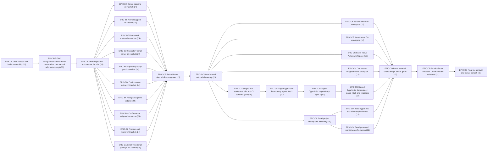

# Critical path

Generated by `constitution-tooling render` from `tasks/epics/`. Do not edit by hand; change the epic files and render again.

## Totals

| Active epics | Open points | Out-of-band epics | Out-of-band points | Waves | Widest wave | Longest chain (points) |
| :--- | :--- | :--- | :--- | :--- | :--- | :--- |
| 29 | 569 | 0 | 0 | 13 | 10 | 256 |

## Longest chain

EPIC-BO → EPIC-BP → EPIC-BQ → EPIC-BR → EPIC-CB → EPIC-CC → EPIC-CD → EPIC-CI → EPIC-CJ → EPIC-CK → EPIC-CO → EPIC-CP → EPIC-CQ (256 points). This bounds wall-clock time however many lanes run.

## Waves

An epic joins a wave when every dependency sits in an earlier wave and it is scope-disjoint from every other epic in the wave. A wave of one is a serial segment.

| Wave | Epic | Kind | Open points | Owns | May patch | Depends on |
| :--- | :--- | :--- | :--- | :--- | :--- | :--- |
| 1 | EPIC-BO Bun refresh and buffer ownership | tooling | 29 | `devenv.nix`, `devenv.lock`, `package.json`, `bun.lock`, `.github/dependabot.yml`, `.github/workflows`, `spec/telemetry`, `tools/scripts/telemetry-codegen.ts`, `typescript/telemetry/semconv/src/lib/generated`, `rust/kernel/src/generated/tuvren_runtime_telemetry.rs`, `typescript/kernel/backends/memory/src`, `.constitution/tech-spec/stack.yaml`, `.changeset/toolchain-bo-bun-refresh.md` | `.constitution/tech-spec/stack.yaml` | — |
| 2 | EPIC-BP OXC configuration and formatter preparation; mechanical reformat exempt | tooling | 33 | `package.json`, `bun.lock`, `.github/dependabot.yml`, `devenv.nix`, `oxlint.config.ts`, `oxfmt.config.ts`, `tools`, `typescript`, `spec`, `reports/compatibility`, `tests`, `tsconfig.base.json`, `tsconfig.json`, `biome.jsonc`, `.constitution/tech-spec/stack.yaml`, `.changeset/toolchain-bp-oxc-preparation.md` | `.constitution/tech-spec/stack.yaml` | EPIC-BO |
| 3 | EPIC-BQ Kernel protocol and runtime lint pilot | tooling | 24 | `typescript/kernel/protocol`, `typescript/kernel/runtime`, `tools/biome-coverage/bq.json`, `.changeset/toolchain-bq-kernel-lint-pilot.md` | — | EPIC-BP |
| 4 | EPIC-BR Kernel backend lint ratchet | tooling | 24 | `typescript/kernel/backends`, `tools/biome-coverage/br.json`, `.changeset/toolchain-br-kernel-backend-lint.md` | — | EPIC-BQ |
| 4 | EPIC-BS Kernel support lint ratchet | tooling | 24 | `typescript/kernel/grpc-client`, `typescript/kernel/testkit`, `typescript/kernel/certification`, `typescript/kernel/certification-sqlite`, `typescript/kernel/certification-postgres`, `tools/biome-coverage/bs.json`, `.changeset/toolchain-bs-kernel-support-lint.md` | — | EPIC-BQ |
| 4 | EPIC-BT Framework runtime lint ratchet | tooling | 24 | `typescript/runtime`, `tools/biome-coverage/bt.json`, `.changeset/toolchain-bt-runtime-lint.md` | — | EPIC-BQ |
| 4 | EPIC-BU Repository script library lint ratchet | tooling | 24 | `tools/scripts/lib`, `tools/biome-coverage/bu.json` | — | EPIC-BQ |
| 4 | EPIC-BV Repository script gate lint ratchet | tooling | 24 | `tools/scripts/kernel-interop-governance.ts`, `tools/scripts/compile-with-migrations.ts`, `tools/scripts/docs-authority-freeze-gate.ts`, `tools/scripts/changeset-check.test.ts`, `tools/scripts/portability-check.ts`, `tools/scripts/host-boundary-gate.ts`, `tools/scripts/changeset-check.ts`, `tools/scripts/compatibility-report.ts`, `tools/scripts/codegen.ts`, `tools/scripts/telemetry-codegen.ts`, `tools/scripts/verify-kernel.ts`, `tools/scripts/portability-gate.ts`, `tools/scripts/validate-workspace-test-coverage.ts`, `tools/scripts/repl-host-interop-smoke.ts`, `tools/scripts/epic-af-conformance-gap-plan.ts`, `tools/scripts/release-lane.ts`, `tools/scripts/publish-registry.ts`, `tools/scripts/check.ts`, `tools/scripts/conformance.ts`, `tools/scripts/verify.ts`, `tools/scripts/typecheck-project.ts`, `tools/scripts/release-check.ts`, `tools/scripts/api-freeze-gate.ts`, `tools/scripts/kraken-surface-gate.ts`, `tools/scripts/authority-guardrails`, `tools/scripts/authority-packet`, `tools/biome-coverage/bv.json` | — | EPIC-BQ |
| 4 | EPIC-BW Conformance tooling lint ratchet | tooling | 24 | `tools/conformance`, `tools/scripts/conformance`, `tools/generators`, `tools/biome-coverage/bw.json` | — | EPIC-BQ |
| 4 | EPIC-BX Host package lint ratchet | tooling | 24 | `typescript/host`, `tools/biome-coverage/bx.json` | — | EPIC-BQ |
| 4 | EPIC-BY Conformance adapter lint ratchet | tooling | 24 | `typescript/conformance-adapter`, `typescript/kernel/conformance-adapter`, `typescript/providers/conformance-adapter`, `tools/biome-coverage/by.json` | — | EPIC-BQ |
| 4 | EPIC-BZ Provider and runner lint ratchet | tooling | 24 | `typescript/providers/provider-api`, `typescript/providers/bridge-ai-sdk`, `typescript/providers/testkit`, `typescript/providers/certification`, `typescript/runners`, `tools/biome-coverage/bz.json`, `.changeset/toolchain-bz-provider-runner-lint.md` | — | EPIC-BQ |
| 4 | EPIC-CA Small TypeScript package lint ratchet | tooling | 24 | `typescript/core`, `typescript/sdk`, `typescript/streaming`, `typescript/tools`, `typescript/testkit`, `typescript/telemetry`, `typescript/certification`, `typescript/certification-batteries-included`, `tools/run-nx.mjs`, `tools/biome-coverage/ca.json`, `.changeset/toolchain-ca-small-package-lint.md` | — | EPIC-BQ |
| 5 | EPIC-CB Retire Biome after all directory gates | tooling | 15 | `package.json`, `bun.lock`, `biome.jsonc`, `nx.json`, `.github/dependabot.yml`, `devenv.nix`, `oxlint.config.ts`, `oxfmt.config.ts`, `typescript`, `spec`, `tools`, `.constitution/tech-spec/stack.yaml`, `.git-blame-ignore-revs`, `.changeset/toolchain-cb-biome-retirement.md` | `.constitution/tech-spec/stack.yaml` | EPIC-BR, EPIC-BS, EPIC-BT, EPIC-BU, EPIC-BV, EPIC-BW, EPIC-BX, EPIC-BY, EPIC-BZ, EPIC-CA |
| 6 | EPIC-CC Bazel shared toolchain bootstrap | tooling | 26 | `MODULE.bazel`, `MODULE.bazel.lock`, `.bazelversion`, `.bazelrc`, `.bazelignore`, `devenv.nix`, `devenv.lock`, `.gitignore`, `user.bazelrc`, `go.work`, `tools/bazel/toolchain-sync.ts`, `tools/bazel/toolchain-sync.test.ts`, `tools/bazel/toolchain-sync.bzl`, `tools/bazel/BUILD.bazel`, `.constitution/tech-spec/stack.yaml`, `go/kernel/BUILD.bazel`, `go/kernel-conformance-adapter/BUILD.bazel`, `go/kernel-certification/BUILD.bazel`, `tools/bazel/python-requirements.txt` | `.constitution/tech-spec/stack.yaml` | EPIC-CB |
| 7 | EPIC-CD Staged Bun workspace pilot and CI sandbox gate | tooling | 24 | `tools/bazel/bun-workspace.bzl`, `tools/bazel/ts-package.bzl`, `tools/bazel/ts-runner.sh`, `typescript/core/BUILD.bazel`, `typescript/kernel/protocol/BUILD.bazel`, `typescript/kernel/runtime/BUILD.bazel`, `.github/workflows/ci.yml`, `MODULE.bazel`, `MODULE.bazel.lock`, `.changeset/toolchain-cd-staged-bun-pilot.md` | — | EPIC-CC |
| 7 | EPIC-CE Bazel-native Rust workspace | tooling | 15 | `rust/kernel/BUILD.bazel`, `rust/kernel-grpc-service/BUILD.bazel`, `rust/conformance-adapter/BUILD.bazel`, `rust/kernel-conformance-adapter/BUILD.bazel`, `rust/certification/BUILD.bazel`, `rust/kernel-certification/BUILD.bazel`, `tools/bazel/rust.bzl` | — | EPIC-CC |
| 7 | EPIC-CF Bazel-native Go workspace | tooling | 10 | `go/kernel/BUILD.bazel`, `go/kernel-conformance-adapter/BUILD.bazel`, `go/kernel-certification/BUILD.bazel`, `tools/bazel/go.bzl` | — | EPIC-CC |
| 7 | EPIC-CG Bazel-native Python workspace | tooling | 10 | `python/kernel/BUILD.bazel`, `python/kernel-conformance-adapter/BUILD.bazel`, `python/kernel-certification/BUILD.bazel`, `tools/bazel/python.bzl`, `tools/bazel/python-requirements.txt`, `tools/bazel/python-lock-drift.sh` | — | EPIC-CC |
| 7 | EPIC-CH Dart native-wrapped Bazel exception | tooling | 13 | `dart/kernel/BUILD.bazel`, `dart/kernel-conformance-adapter/BUILD.bazel`, `dart/kernel-certification/BUILD.bazel`, `dart/kernel-conformance-adapter/test/protocol_test.dart`, `tools/bazel/dart.bzl`, `tools/bazel/dart-runner.sh` | — | EPIC-CC |
| 7 | EPIC-CL Bazel project identity and discovery | tooling | 15 | `tools/bazel/project-tags.bzl`, `tools/bazel/project-manifest.bzl`, `tools/bazel/projects.json`, `tools/scripts/lib/nx-projects.ts`, `tools/scripts/validate-workspace-test-coverage.ts`, `tools/scripts/lib/regenerate-command-argv.ts`, `tools/scripts/lib/regenerate-command-argv.test.ts` | — | EPIC-CC |
| 8 | EPIC-CI Staged TypeScript dependency layers 0 to 2 | tooling | 10 | `typescript/host/session-client/BUILD.bazel`, `typescript/telemetry/semconv/BUILD.bazel`, `typescript/host/session/BUILD.bazel`, `typescript/providers/provider-api/BUILD.bazel`, `typescript/streaming/core/BUILD.bazel`, `typescript/telemetry/otel/BUILD.bazel`, `typescript/testkit/BUILD.bazel`, `typescript/host/remote-session/BUILD.bazel`, `typescript/kernel/backends/shared/BUILD.bazel`, `typescript/kernel/grpc-client/BUILD.bazel`, `typescript/providers/bridge-ai-sdk/BUILD.bazel`, `typescript/providers/testkit/BUILD.bazel`, `typescript/runners/react/BUILD.bazel`, `typescript/runtime/BUILD.bazel`, `typescript/streaming/agui/BUILD.bazel`, `typescript/streaming/sse/BUILD.bazel`, `.changeset/toolchain-ci-bazel-ts-kernel-runtime.md` | — | EPIC-CD |
| 8 | EPIC-CM Bazel TypeSpec and telemetry freshness | tooling | 13 | `tools/bazel/source-codegen.bzl`, `tools/bazel/source-codegen-runner.sh`, `tools/scripts/codegen.ts`, `tools/scripts/telemetry-codegen.ts`, `tools/generators`, `spec/core`, `spec/providers`, `spec/runners`, `spec/tools`, `spec/host`, `spec/streaming`, `spec/telemetry`, `typescript/telemetry/semconv/src/lib/generated`, `rust/kernel/src/generated/tuvren_runtime_telemetry.rs`, `tools/bazel/source-codegen`, `.changeset/toolchain-cm-bazel-source-codegen.md` | — | EPIC-CL |
| 8 | EPIC-CN Bazel proto and conformance freshness | tooling | 21 | `tools/bazel/interop-codegen.bzl`, `tools/bazel/interop-codegen-runner.sh`, `tools/scripts/conformance`, `tools/scripts/compatibility-report.ts`, `tools/scripts/api-freeze-gate.ts`, `tools/scripts/__snapshots__`, `spec/interop`, `spec/kernel`, `spec/conformance`, `reports/compatibility`, `typescript/kernel/grpc-client/src/lib/generated/kernel-interop`, `tools/bazel/interop-codegen`, `.changeset/toolchain-cn-bazel-interop-codegen.md` | — | EPIC-CL |
| 9 | EPIC-CJ Staged TypeScript dependency layer 3 | tooling | 10 | `typescript/kernel/backends/memory/BUILD.bazel`, `typescript/kernel/backends/postgres/BUILD.bazel`, `typescript/kernel/backends/sqlite/BUILD.bazel`, `typescript/kernel/testkit/BUILD.bazel`, `typescript/certification/BUILD.bazel`, `typescript/sdk/BUILD.bazel`, `typescript/streaming/ws/BUILD.bazel`, `.changeset/toolchain-cj-bazel-ts-host-adapters.md` | — | EPIC-CI |
| 10 | EPIC-CK Staged TypeScript dependency layers 4 to 5 and wrappers | tooling | 10 | `typescript/kernel/certification/BUILD.bazel`, `typescript/providers/certification/BUILD.bazel`, `typescript/tools/mcp-client/BUILD.bazel`, `typescript/conformance-adapter/BUILD.bazel`, `typescript/kernel/conformance-adapter/BUILD.bazel`, `typescript/providers/conformance-adapter/BUILD.bazel`, `typescript/host/repl/BUILD.bazel`, `typescript/kernel/certification-sqlite/BUILD.bazel`, `typescript/kernel/certification-postgres/BUILD.bazel`, `typescript/certification-batteries-included/BUILD.bazel`, `.changeset/toolchain-ck-bazel-ts-packages.md` | — | EPIC-CJ |
| 11 | EPIC-CO Bazel external suites and git-aware gates | tooling | 15 | `tools/bazel/service-tests.bzl`, `tools/bazel/service-test-runner.sh`, `tools/bazel/git-gates.bzl`, `tools/conformance`, `tools/scripts/conformance.ts`, `tools/scripts/lib/worktree-guard.ts`, `tools/scripts/changeset-check.ts`, `tools/scripts/changeset-check.test.ts`, `tools/scripts/check.ts`, `tools/scripts/kernel-interop-governance.ts`, `tools/scripts/repl-host-interop-smoke.ts`, `tools/scripts/proving-host-sqlite-pinned.sh`, `BUILD.bazel` | — | EPIC-CE, EPIC-CF, EPIC-CG, EPIC-CH, EPIC-CK, EPIC-CM, EPIC-CN |
| 12 | EPIC-CP Bazel affected selection CI and release rehearsal | tooling | 21 | `tools/bazel/affected-selection`, `tools/scripts/publish-registry.ts`, `tools/scripts/release-check.ts`, `tools/scripts/release-lane.ts`, `.github/workflows/ci.yml`, `.github/workflows/release.yml`, `.github/dependabot.yml`, `package.json`, `bun.lock` | — | EPIC-CO |
| 13 | EPIC-CQ Final Nx removal and owner handoff | tooling | 15 | `nx.json`, `package.json`, `bun.lock`, `tools/run-nx.mjs`, `tools/nx`, `tools/bazel/nx-run.sh`, `tools/bazel/native_binary.bzl`, `tools/bazel/BUILD.bazel`, `tools/scripts/verify.ts`, `tools/scripts/verify-kernel.ts`, `tools/scripts/check.ts`, `tools/scripts/lib/nx-projects.ts`, `.github/workflows/ci.yml`, `CLAUDE.md`, `AGENTS.md`, `BUILD.bazel`, `typescript`, `rust`, `go`, `python`, `dart`, `spec`, `reports/compatibility`, `.constitution/tech-spec/stack.yaml`, `.constitution/tech-spec/guidelines.md`, `.constitution/tech-spec/adrs/ADR-0069-public-release-discipline.md`, `tools/scripts/lib/project-manifest.ts`, `.changeset/toolchain-cq-nx-final-cutover.md` | `.constitution/tech-spec/stack.yaml`, `.constitution/tech-spec/guidelines.md`, `.constitution/tech-spec/adrs/ADR-0069-public-release-discipline.md` | EPIC-CP |

## Build order

```mermaid
flowchart LR
  BO["EPIC-BO Bun refresh and buffer ownership (29)"]
  BP["EPIC-BP OXC configuration and formatter preparation; mechanical reformat exempt (33)"]
  BQ["EPIC-BQ Kernel protocol and runtime lint pilot (24)"]
  BR["EPIC-BR Kernel backend lint ratchet (24)"]
  BS["EPIC-BS Kernel support lint ratchet (24)"]
  BT["EPIC-BT Framework runtime lint ratchet (24)"]
  BU["EPIC-BU Repository script library lint ratchet (24)"]
  BV["EPIC-BV Repository script gate lint ratchet (24)"]
  BW["EPIC-BW Conformance tooling lint ratchet (24)"]
  BX["EPIC-BX Host package lint ratchet (24)"]
  BY["EPIC-BY Conformance adapter lint ratchet (24)"]
  BZ["EPIC-BZ Provider and runner lint ratchet (24)"]
  CA["EPIC-CA Small TypeScript package lint ratchet (24)"]
  CB["EPIC-CB Retire Biome after all directory gates (15)"]
  CC["EPIC-CC Bazel shared toolchain bootstrap (26)"]
  CD["EPIC-CD Staged Bun workspace pilot and CI sandbox gate (24)"]
  CE["EPIC-CE Bazel-native Rust workspace (15)"]
  CF["EPIC-CF Bazel-native Go workspace (10)"]
  CG["EPIC-CG Bazel-native Python workspace (10)"]
  CH["EPIC-CH Dart native-wrapped Bazel exception (13)"]
  CI["EPIC-CI Staged TypeScript dependency layers 0 to 2 (10)"]
  CJ["EPIC-CJ Staged TypeScript dependency layer 3 (10)"]
  CK["EPIC-CK Staged TypeScript dependency layers 4 to 5 and wrappers (10)"]
  CL["EPIC-CL Bazel project identity and discovery (15)"]
  CM["EPIC-CM Bazel TypeSpec and telemetry freshness (13)"]
  CN["EPIC-CN Bazel proto and conformance freshness (21)"]
  CO["EPIC-CO Bazel external suites and git-aware gates (15)"]
  CP["EPIC-CP Bazel affected selection CI and release rehearsal (21)"]
  CQ["EPIC-CQ Final Nx removal and owner handoff (15)"]
  BO --> BP
  BP --> BQ
  BQ --> BR
  BQ --> BS
  BQ --> BT
  BQ --> BU
  BQ --> BV
  BQ --> BW
  BQ --> BX
  BQ --> BY
  BQ --> BZ
  BQ --> CA
  BR --> CB
  BS --> CB
  BT --> CB
  BU --> CB
  BV --> CB
  BW --> CB
  BX --> CB
  BY --> CB
  BZ --> CB
  CA --> CB
  CB --> CC
  CC --> CD
  CC --> CE
  CC --> CF
  CC --> CG
  CC --> CH
  CD --> CI
  CI --> CJ
  CJ --> CK
  CC --> CL
  CL --> CM
  CL --> CN
  CE --> CO
  CF --> CO
  CG --> CO
  CH --> CO
  CK --> CO
  CM --> CO
  CN --> CO
  CO --> CP
  CP --> CQ
```

An arrow points from a prerequisite to the epic that depends on it, so it reads in the order work flows, the same direction as the longest chain above.

## Ticket order inside each epic

A dependency-respecting listing, not a chain: `needs` names a ticket's own `depends_on` inside its epic, and a ticket without one has no in-epic dependency. Readiness is epic-level: a ticket finished on an unmerged branch satisfies no other epic's dependency until the containing PR merges.

- **EPIC-BO:** KRT-BO001, KRT-BO002 (needs KRT-BO001), KRT-BO003 (needs KRT-BO002), KRT-BO004 (needs KRT-BO003), KRT-BO005 (needs KRT-BO004)
- **EPIC-BP:** KRT-BP007, KRT-BP002, KRT-BP001 (needs KRT-BP007, KRT-BP002), KRT-BP008 (needs KRT-BP001), KRT-BP003 (needs KRT-BP008, KRT-BP002), KRT-BP004 (needs KRT-BP003), KRT-BP005 (needs KRT-BP004), KRT-BP006 (needs KRT-BP005)
- **EPIC-BQ:** KRT-BQ001, KRT-BQ002 (needs KRT-BQ001), KRT-BQ003 (needs KRT-BQ002), KRT-BQ004 (needs KRT-BQ003)
- **EPIC-BR:** KRT-BR001, KRT-BR002 (needs KRT-BR001), KRT-BR003 (needs KRT-BR002), KRT-BR004 (needs KRT-BR003)
- **EPIC-BS:** KRT-BS001, KRT-BS002 (needs KRT-BS001), KRT-BS003 (needs KRT-BS002), KRT-BS004 (needs KRT-BS003)
- **EPIC-BT:** KRT-BT001, KRT-BT002 (needs KRT-BT001), KRT-BT003 (needs KRT-BT002), KRT-BT004 (needs KRT-BT003)
- **EPIC-BU:** KRT-BU001, KRT-BU002 (needs KRT-BU001), KRT-BU003 (needs KRT-BU002), KRT-BU004 (needs KRT-BU003)
- **EPIC-BV:** KRT-BV001, KRT-BV002 (needs KRT-BV001), KRT-BV003 (needs KRT-BV002), KRT-BV004 (needs KRT-BV003)
- **EPIC-BW:** KRT-BW001, KRT-BW002 (needs KRT-BW001), KRT-BW003 (needs KRT-BW002), KRT-BW004 (needs KRT-BW003)
- **EPIC-BX:** KRT-BX001, KRT-BX002 (needs KRT-BX001), KRT-BX003 (needs KRT-BX002), KRT-BX004 (needs KRT-BX003)
- **EPIC-BY:** KRT-BY001, KRT-BY002 (needs KRT-BY001), KRT-BY003 (needs KRT-BY002), KRT-BY004 (needs KRT-BY003)
- **EPIC-BZ:** KRT-BZ001, KRT-BZ002 (needs KRT-BZ001), KRT-BZ003 (needs KRT-BZ002), KRT-BZ004 (needs KRT-BZ003)
- **EPIC-CA:** KRT-CA001, KRT-CA002 (needs KRT-CA001), KRT-CA003 (needs KRT-CA002), KRT-CA004 (needs KRT-CA003)
- **EPIC-CB:** KRT-CB001, KRT-CB002 (needs KRT-CB001), KRT-CB003 (needs KRT-CB002), KRT-CB004 (needs KRT-CB003), KRT-CB005
- **EPIC-CC:** KRT-CC001, KRT-CC002 (needs KRT-CC001), KRT-CC003 (needs KRT-CC002), KRT-CC004 (needs KRT-CC003), KRT-CC005 (needs KRT-CC004)
- **EPIC-CD:** KRT-CD001, KRT-CD002 (needs KRT-CD001), KRT-CD003 (needs KRT-CD002)
- **EPIC-CE:** KRT-CE001, KRT-CE002 (needs KRT-CE001), KRT-CE003 (needs KRT-CE002)
- **EPIC-CF:** KRT-CF001, KRT-CF002 (needs KRT-CF001)
- **EPIC-CG:** KRT-CG001, KRT-CG002 (needs KRT-CG001)
- **EPIC-CH:** KRT-CH001, KRT-CH002 (needs KRT-CH001)
- **EPIC-CI:** KRT-CI001, KRT-CI002 (needs KRT-CI001)
- **EPIC-CJ:** KRT-CJ001, KRT-CJ002 (needs KRT-CJ001)
- **EPIC-CK:** KRT-CK001, KRT-CK002 (needs KRT-CK001)
- **EPIC-CL:** KRT-CL001, KRT-CL002 (needs KRT-CL001), KRT-CL003 (needs KRT-CL002)
- **EPIC-CM:** KRT-CM001, KRT-CM002 (needs KRT-CM001), KRT-CM003 (needs KRT-CM002)
- **EPIC-CN:** KRT-CN001, KRT-CN002 (needs KRT-CN001), KRT-CN003 (needs KRT-CN002), KRT-CN004 (needs KRT-CN003)
- **EPIC-CO:** KRT-CO001, KRT-CO002 (needs KRT-CO001), KRT-CO003 (needs KRT-CO002)
- **EPIC-CP:** KRT-CP001, KRT-CP002 (needs KRT-CP001), KRT-CP003 (needs KRT-CP002), KRT-CP004 (needs KRT-CP003)
- **EPIC-CQ:** KRT-CQ001, KRT-CQ002 (needs KRT-CQ001), KRT-CQ003 (needs KRT-CQ002), KRT-CQ004 (needs KRT-CQ003)

## Concurrency mechanics

- **Worktree:** one worktree per epic, not recorded yet in constitution.yaml
- **Branch naming:** type/description, not recorded yet in constitution.yaml
- **Merge strategy:** not recorded yet in constitution.yaml
